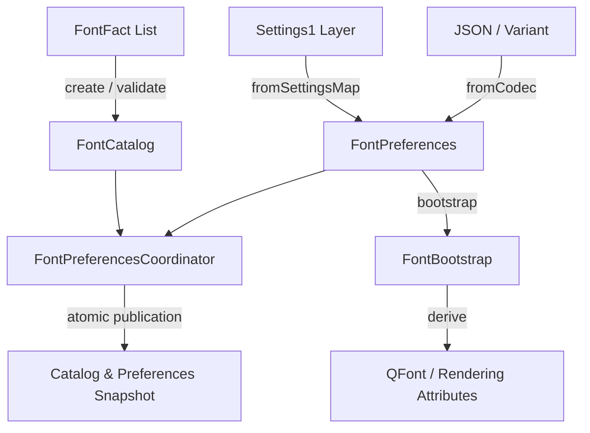

# Font preferences

`src/services/font_preferences` provides a pure, installed Qt boundary for
deterministic typography catalog discovery, preference validation, and
pre-application bootstrap derivation without runtime fontconfig daemon mutation
or host filesystem scanning.

## Architecture

### Components

1. **`FontFact` (`font_fact.h`)**: Pure value struct representing an injected
   font file or pattern discovery fact (family name, style, monospace flag,
   scalability, weight, italic slant, postscript name). Facts containing control
   characters or empty names are rejected.
2. **`FontCatalog` (`font_catalog.h`)**: Immutable snapshot of discovered font
   families. Normalizes family names (whitespace collapse, case-insensitive
   deduplication), verifies that monospace flags do not conflict, aggregates
   sorted unique styles per family, and sorts families deterministically by
   case-folded canonical key. Provides `createDefaultFallback()` for baseline
   system typography.
3. **`FontPreferences` (`font_preferences.h`)**: Validated typography preferences
   governing standard family, monospace family, point size (`[4.0, 144.0]`),
   antialiasing mode (`none`, `grayscale`, `subpixel`), hinting (`none`, `slight`,
   `medium`, `full`), subpixel ordering (`none`, `rgb`, `bgr`, `vrgb`, `vbgr`),
   and optional logical DPI (`[48.0, 576.0]`).
4. **`FontPreferencesCodec` (`font_preferences_codec.h`)**: Bidirectional lossless
   codecs between `FontPreferences` and JSON objects, `QVariantMap`, and
   Settings1 schema-v2 keys (`fonts.family`, `fonts.monospaceFamily`,
   `fonts.pointSize`, `fonts.antialiasing`, `fonts.hinting`, `fonts.subpixelOrder`).
5. **`FontBootstrap` (`font_bootstrap.h`)**: Pre-application helper creating
   configured `QFont` instances and toolkit rendering attributes prior to QML
   engine or window construction.
6. **`FontPreferencesCoordinator` (`font_preferences_coordinator.h`)**: Coordinates
   atomic updates to preferences and catalog snapshots. Tracks monotonic integer
   revisions and preserves Last-Known-Good (LKG) snapshots when candidate
   refreshes or preference updates fail validation.

## Invariants

- **AGENT-GUARD:** Font preferences and catalog instances are pure and
  thread-confined. Discovery does not scan the host filesystem or mutate
  system font configuration.
- **AGENT-GUARD:** Mismatched monospace flags or unprintable characters in font
  facts cause catalog creation to fail, preserving the prior LKG catalog.
- **AGENT-CONTRACT:** Codecs map cleanly to Settings1 `fonts.*` schema properties
  and QST-1 type scaling requirements.

## See also

- [ADR-0042: Pure Font F0 catalog and preference boundary](../adr/0042-pure-font-catalog-and-preference-boundary.md)
- [Module boundaries](module-boundaries.md)
- [Design tokens](design-tokens.md)
