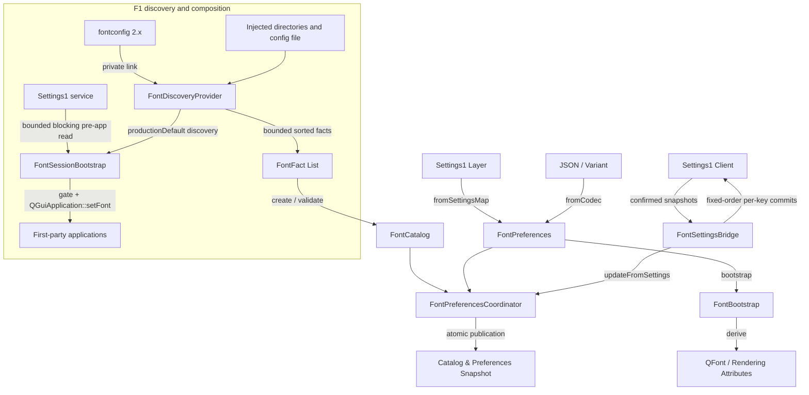

# Font preferences

`src/services/font_preferences` provides a pure, installed Qt boundary for
deterministic typography catalog discovery, preference validation, and
pre-application bootstrap derivation without runtime fontconfig daemon mutation
or host filesystem scanning. Font F1 adds the live fontconfig discovery
provider (`src/services/font_discovery`), the Settings1 persistence
composition, and the first-party bootstrap wiring on top of that pure base.

## Architecture



### Components

1. **`FontFact` (`font_fact.h`)**: Pure value struct representing an injected
   font file or pattern discovery fact (family name, style, monospace flag,
   scalability, weight, italic slant, postscript name). Every published string
   field (family, style, PostScript name) must be free of NUL/control
   characters, and the family must be non-blank; a fact violating this is
   rejected, which rejects the whole discovery pattern or catalog creation.
2. **`FontCatalog` (`font_catalog.h`)**: Immutable snapshot of discovered font
   families. Normalizes family names (whitespace collapse, case-insensitive
   deduplication), verifies that monospace flags do not conflict, aggregates
   sorted unique styles per family, and sorts families deterministically by
   case-folded canonical key. Provides `createDefaultFallback()` for baseline
   system typography.
3. **`FontPreferences` (`font_preferences.h`)**: Validated typography preferences
   governing standard family, monospace family, point size (`[6.0, 36.0]`),
   antialiasing mode (`none`, `grayscale`, `subpixel`), hinting (`none`, `slight`,
   `medium`, `full`), subpixel ordering (`none`, `rgb`, `bgr`, `vrgb`, `vbgr`),
   and optional logical DPI (`[48.0, 576.0]`).
4. **`FontPreferencesCodec` (`font_preferences_codec.h`)**: Bidirectional lossless
   codecs between `FontPreferences` and JSON objects, `QVariantMap`, and
   Settings1 schema-v2 keys (`fonts.family`, `fonts.monospaceFamily`,
   `fonts.pointSize`, `fonts.antialiasing`, `fonts.hinting`, `fonts.subpixelOrder`).
   `fromSettingsMap` is exact-typed: any wrong-typed value (an integer family,
   a string point size, a non-boolean antialiasing flag) rejects the whole
   snapshot with no `QVariant` coercion.
5. **`FontBootstrap` (`font_bootstrap.h`)**: Pure pre-application helper creating
   configured `QFont` instances and toolkit rendering attributes prior to QML
   engine or window construction.
6. **`FontPreferencesCoordinator` (`font_preferences_coordinator.h`)**: Coordinates
   atomic updates to preferences and catalog snapshots. Tracks monotonic integer
   revisions and preserves Last-Known-Good (LKG) snapshots when candidate
   refreshes or preference updates fail validation.

## Font F1 discovery provider

`src/services/font_discovery` (`qindaqt_font_discovery`, aliased
`QindaQt::FontDiscovery`) is the only module that includes fontconfig headers
or links fontconfig (ADR-0057). It also hosts the F1 production composition
root (`FontSessionBootstrap`, see below), which is the module's only Qt
D-Bus/Gui consumer. `FontDiscoveryProvider` turns a
`FontDiscoveryRequest` into a bounded, deterministically sorted list of F0
`FontFact` values:

- The provider builds its `FcConfig` internally from the injected
  configuration file and injected font directories; the `FcConfig` never
  escapes the module. Tests always inject both, so the host's default
  fontconfig configuration and host font directories are never consulted.
  Only the exact `FontDiscoveryRequest::productionDefault()` shape (empty
  configuration file AND no injected directories) may resolve the default
  fontconfig configuration; a request carrying injected directories but no
  configuration file is ill-formed and rejected fail-closed, so a
  non-production request can never enumerate ambient host font state.
- Discovery is fail-closed: a malformed request, an unparsable or missing
  configuration file, a missing injected directory, or a fontconfig
  initialization/build failure yields `available == false` with a bounded
  diagnostic and zero facts. The host font configuration is never mutated.
- Bounds are contractual: at most `maximumFacts` facts are retained (default
  4,096; excess drops the deterministic tail and sets `truncated`), and any
  string field longer than `maximumStringBytes` UTF-8 bytes (default 512)
  rejects the whole pattern rather than truncating into an aliased identity.
- Published order is an explicit sort over the facts; `FcFontList` cache order
  is never observable. fontconfig weights are mapped onto the CSS/OpenType
  scale used by `FontFact` (400 regular), slant `italic` sets the italic flag,
  and fontconfig mono spacing sets the monospace flag.
- The per-file identity (`FC_FILE`) stays inside the provider; facts carry the
  PostScript name as their stable pattern identity.

## Font F1 Settings1 persistence composition

`FontSettingsBridge` (`font_settings_bridge.h`) composes the pure coordinator
with the public Settings1 client, following the ADR-0028 recovery contract:

- `scopedKeys()` names the six `fonts.*` schema-v2 keys in a fixed order; the
  client must be scoped to exactly these keys.
- Every confirmed (Ready-state) snapshot is decoded through
  `FontPreferencesCodec::fromSettingsMap` and applied with
  `FontPreferencesCoordinator::updateFromSettings`, so preference updates stay
  atomic with the LKG coordination. A snapshot that fails validation changes
  nothing and is reported through `lastSyncError()`.
- `applyPreferences(draft)` writes the six keys as a sequence of single-key
  optimistic commits in `scopedKeys()` order, waiting for a fresh
  authoritative snapshot between keys so no write carries a stale base
  revision. Per-key truth is kept in `lastApplyResults()` (`Applied`,
  `Conflict`, `Failed`, `Uncertain`, `NotAttempted`); a conflict or failure
  stops the sequence, later keys stay `NotAttempted`, and an uncertain write
  is never replayed automatically. A post-commit snapshot that fails
  validation also ends the sequence instead of advancing it: the applied key
  keeps its confirmed truth and every later key stays `NotAttempted`. The
  sequence never claims to be one atomic transaction.
- The bridge fails closed on transport loss: writes are refused unless the
  client is Ready, owner loss ends an in-flight sequence, and the coordinator
  keeps its last-known-good preferences throughout.

## Font F1 first-party bootstrap wiring

`FontSessionBootstrap` (`font_session_bootstrap.h`, module
`src/services/font_discovery`) is the F1 production composition root. Each
first-party application (Settings Center, Text Editor, File Manager,
Terminal) calls `FontSessionBootstrap::applyFromSessionSettings()` exactly
once as a single guarded line **before `QGuiApplication` construction**.
This placement is possible and safe on Qt 6.11 because
`QGuiApplication::setFont()` invoked pre-construction persists as the
application default font, and blocking D-Bus calls work without an
application object (an event loop does not, so the read never uses one).
The composition:

1. Refuses to run when `DBUS_SESSION_BUS_ADDRESS` is unset — a missing
   address means no preference source, never an autolaunched bus.
2. Reads the confirmed `fonts.*` snapshot through a **private**
   `connectToBus()` session-bus connection with bounded blocking calls
   (`DefaultBootstrapTimeoutMilliseconds`, 750 ms total across activation,
   owner lookup, and the snapshot read). The shared `sessionBus()` is never
   created pre-application, so later in-process consumers of it keep their
   event-dispatcher integration. The snapshot envelope is validated
   fail-closed (exact field set, exact-typed status/schema/epoch/revision,
   exact key scope) and decoded through the exact-typed
   `FontPreferencesCodec::fromSettingsMap`.
3. Runs the discovery provider with
   `FontDiscoveryRequest::productionDefault()` — the only request shape
   allowed to resolve the default fontconfig configuration — and applies the
   confirmed family only when it resolves (case-insensitively) in the live
   catalog. Discovery unavailability or an unresolvable family changes
   nothing.
4. Applies family, point size, hinting, and antialiasing through
   `FontSettingsBootstrap::applyPreferences()` (the pure half of the
   bootstrap, in `font_preferences`).

Every failure path returns `false` with a bounded diagnostic and leaves
platform/theme defaults untouched; the call sites deliberately ignore the
result. In the QML applications (Settings Center, File Manager) the applied
font becomes the application font before the QML engine exists. In the
widget applications (Text Editor, Terminal) the theme baseline
`application.setFont(...)` runs after construction and remains the
deliberate widgets baseline; the confirmed preference is then the
pre-window platform default underneath it. The shell is deliberately
untouched.

The monospace family and logical DPI are persisted and validated but not
applied globally: Qt has no application-wide monospace default, and logical
DPI is fixed before platform integration reads it. Both remain available to
consumers through the coordinator snapshot.

## Invariants

- **AGENT-GUARD:** Font preferences and catalog instances are pure and
  thread-confined. Discovery does not scan the host filesystem or mutate
  system font configuration; only the discovery provider links fontconfig, and
  it never mutates the host configuration either. Only the exact
  `productionDefault()` request shape may resolve the default fontconfig
  configuration.
- **AGENT-GUARD:** Mismatched monospace flags or unprintable/control
  characters in any string field of a font fact (family, style, PostScript
  name) reject the fact, which fails catalog creation or drops the discovery
  pattern, preserving the prior LKG catalog.
- **AGENT-GUARD:** Qt D-Bus appears only in the F1 session bootstrap
  composition (`src/services/font_discovery/src/font_session_bootstrap.cpp`);
  the `font_preferences` module and the discovery provider are transport-free.
  The boundary gates are `qindaqt.font-preferences-boundary` and
  `qindaqt.font-discovery-boundary`.
- **AGENT-CONTRACT:** Codecs map cleanly to Settings1 `fonts.*` schema properties
  and QST-1 type scaling requirements; Settings1 decoding is exact-typed and
  rejects a wrong-typed snapshot wholesale.
- **AGENT-CONTRACT:** The bootstrap call is guarded: a missing or unavailable
  preference source leaves platform/theme defaults untouched and is not an
  application error.

## Verification

```sh
ctest --test-dir build/dev -R '^qindaqt\.font-' --output-on-failure
```

See the Font F0/F1 rows in the
[testing harness](../development/testing-harness.md#current-font-f0-and-f1-proof).

## See also

- [ADR-0047: Pure Font F0 catalog and preference boundary](../adr/0047-pure-font-catalog-and-preference-boundary.md)
- [ADR-0057: Confine fontconfig behind the Font F1 discovery provider](../adr/0057-confine-fontconfig-behind-font-discovery.md)
- [ADR-0028: Compose the Appearance settings route through Settings1 and QST-1](../adr/0028-compose-appearance-settings-through-settings1.md)
- [Module boundaries](module-boundaries.md)
- [Design tokens](design-tokens.md)
